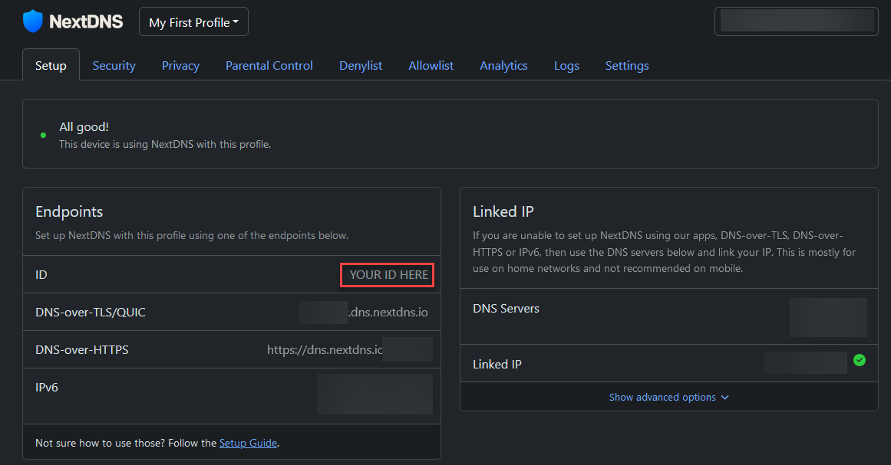
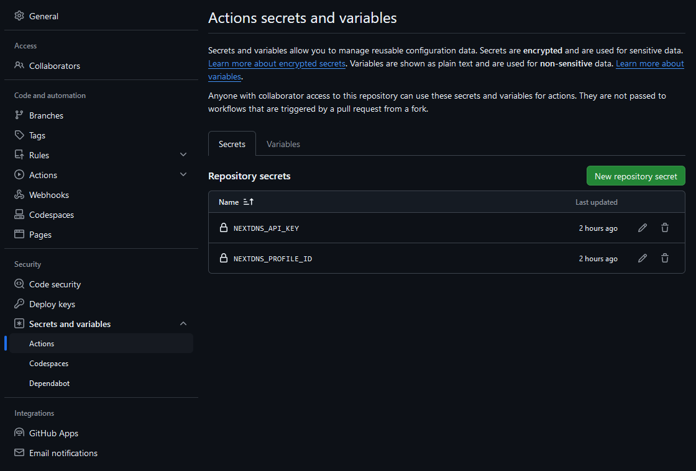

# nextdns-rewrites

This repo runs an [Action/workflow](.github/workflows/nextdns-rewrites.yaml) that updates NextDNS rewrites for archive.today, archive.is and archive.ph.
Requires the following secrets to be set:  
`NEXTDNS_PROFILE_ID`   
`NEXTDNS_API_KEY`  

Api key can be fetched by going to account and profileid can be found on the Setup page.

### Setting Up GitHub Secrets
To set up the required GitHub secrets, go to your repository settings and navigate to **Secrets and variables > Actions**. Click on **New repository secret** and add the necessary keys.

